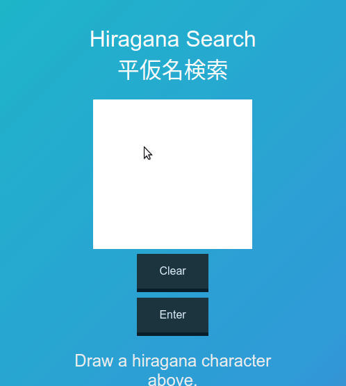

<!--  -->

# Hiragana Search

>Find any japanese hiragana character by drawing it on the screen!

Deployed at https://sanketkumarsinghiitkgp.github.io/hiragana-search/
Backend at https://hiragana-search.appspot.com/img/

## Tools used

- React
- CSS
- Flask
- keras

This app uses react for the frontend. This repository contains the frontend.
The backend can be found <a href="https://github.com/sanketkumarsinghiitkgp/hiragana-search-backend">here</a>

The React app was created using create-react-app.

The backend was deployed on Google cloud platform at https://hiragana-search.appspot.com/img/ .

The keras model is a simple feed forward CNN trained on Kuzushiji-MNIST dataset.